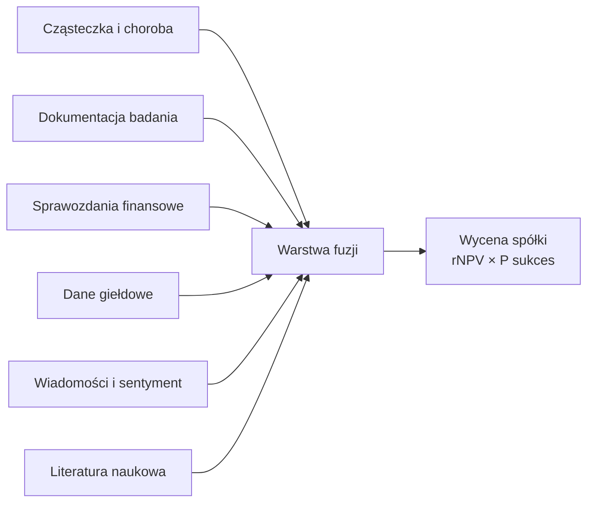
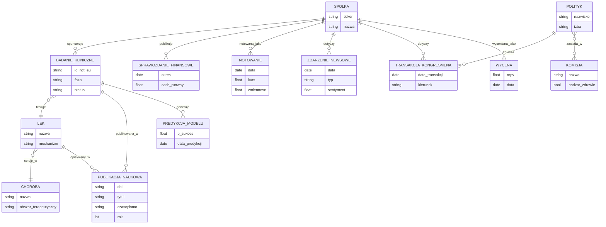
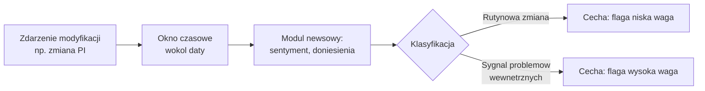

# Struktura danych – praca magisterska

Sep 20, 2026 · @Wiktor

**Temat pracy:** „Zastosowanie sieci neuronowych do predykcji prawdopodobieństwa powodzenia badań klinicznych w wycenie spółek biotechnologicznych”

Proponowana struktura dzieli dane na pięć równoległych modułów analitycznych, z których każdy przechodzi przez własny pipeline raw → structured → features, zanim trafi do wspólnej warstwy fuzji zasilającej model predykcji i wycenę spółki.

## Architektura modułowa

Pięć modułów działa równolegle i zasila wspólną warstwę fuzji, która dopiero łączy sygnały w jedną predykcję i wycenę.



Moduły A i B (bio-kliniczne) są inspirowane architekturą HINT (Fu et al., 2022) — osobne embeddingi dla struktury molekuły, choroby i protokołu badania, łączone grafem interakcji. Moduły C i D dostarczają kontekst finansowo-rynkowy specyficzny dla spółek pre-revenue. Moduł E jest najbardziej szumowy i traktowany jako cecha uzupełniająca, nie główny predyktor.

## Warstwy przetwarzania danych

Każdy moduł przechodzi przez trzy warstwy, żeby heterogeniczne źródła (rejestry, sprawozdania, tekst) dało się połączyć w jeden zbiór wejściowy dla sieci neuronowej.

| Warstwa | Zawartość | Format |
| --- | --- | --- |
| Raw | Surowe dokumenty i zdarzenia (np. zmiana kierownika projektu, aktualizacja rekordu badania) | JSON, niejednorodny między źródłami |
| Structured event log | Znormalizowany log zdarzeń, jeden wiersz = jedno zdarzenie, wspólny schemat niezależnie od źródła | Tabela relacyjna |
| Features | Cechy skalarne/kategoryczne gotowe dla modelu (np. `pi_changed_last_90d`, `num_pi_changes_total`) | Wektory liczbowe |

Gęsty tekst (kryteria kwalifikacji, opis protokołu, treść newsów) trafia do warstwy features jako embedding z pretrenowanego modelu językowego, a nie jako ręcznie liczona cecha — przy małej próbie (rząd tysięcy badań w pracy magisterskiej) ręczne cechy niosą więcej sygnału dla rzadkich zdarzeń dyskretnych, ale gubiłyby informację zawartą w bogatym tekście.

## Źródła danych po modułach

| Moduł | Główne źródła | Przykładowe pola |
| --- | --- | --- |
| Cząsteczka i choroba | ChEMBL, DrugBank, komponenty modelu HINT | SMILES, cel biologiczny, mechanizm działania |
| Dokumentacja badania | ClinicalTrials.gov (AACT), CTIS/EUCTR | faza, design, wielkość próby, kryteria kwalifikacji |
| Sprawozdania finansowe | Raporty roczne/kwartalne spółek, filingi SEC | cash runway, wydatki R&D, struktura finansowania |
| Dane giełdowe | Notowania spółek publicznych | kurs, zmienność, reakcja na wcześniejsze ogłoszenia |
| Wiadomości i sentyment | Reddit, Google News, komunikaty prasowe | sentyment, zmiany kierownictwa, doniesienia medialne |

AACT jest relacyjną bazą agregującą ClinicalTrials.gov (51 tabel, aktualizacja codzienna) i stanowi trzon modułu dokumentacji badania; CTIS nie ma oficjalnego API publicznego, więc dane europejskie wymagają narzędzia `ctrdata` (R) lub odtworzenia jego logiki.

## Problem punktu w czasie i zmienna celu

Model musi widzieć dane wyłącznie z momentu, w którym predykcja miałaby realną wartość — nie z finalnego rekordu badania, bo to prowadzi do data leakage (model "widzi przyszłość"). Wymaga to cyklicznych snapshotów bazy AACT/CTIS albo filtrowania pól po dacie ich powstania względem `primary_completion_date`.

Zmienna celu (przejście do kolejnej fazy vs. terminacja) opiera się częściowo na polu `why_stopped`, które w AACT jest wolnym tekstem — wymaga klasyfikacji (reguły słownikowe lub NLP) do postaci binarnej etykiety sukces/porażka.

## Dane giełdowe: historia, real-time i analiza czasu trwania

Moduł giełdowy dzieli się na trzy warstwy o różnym przeznaczeniu.

| Warstwa | Cel | Źródło | Charakterystyka |
| --- | --- | --- | --- |
| Dane historyczne – cechy | Wejście do modelu (zmienność, trend przed eventem) | Dane end-of-day (Yahoo Finance, Stooq, EOD Historical Data) | Statyczne, pobierane okresowo, wersjonowane |
| Dane historyczne – backtest | Walidacja modelu na danych z przeszłości, walk-forward | Te same źródła, z rygorem point-in-time | Chronologiczny podział trening/test, bez losowego splitu |
| Dane real-time | Ewentualne demo modelu na żywo | API czasu rzeczywistego lub z opóźnieniem (Alpha Vantage, IEX) | Lekki komponent, nie wpływa na trening |

Statystyczną podstawą backtestu — i samej definicji zmiennej celu w module dokumentacji badania — powinna być analiza czasu trwania (survival analysis), a nie tylko prosta klasyfikacja binarna sukces/porażka:

- Zmienna celu jako czas do zdarzenia (time-to-event) — czas od rozpoczęcia fazy do jej zakończenia sukcesem, terminacją, lub trwania nadal
- Cenzurowanie prawostronne — badania wciąż aktywne w momencie odcięcia danych są cenzurowane, a nie usuwane czy liczone jako porażka
- Konkurujące ryzyka (competing risks) — przejście do kolejnej fazy, terminacja i "nadal trwa" to trzy wzajemnie wykluczające się zdarzenia, co wymaga modelu subdystrybucji (Fine-Gray) zamiast standardowego estymatora Kaplana-Meiera
- Model Coxa proporcjonalnych hazardów pozwala włączyć zmienne z pozostałych modułów (finansowe, giełdowe, cechy badania) jako kowarianty, w tym zmienne zmieniające się w czasie
- Backtesting sprowadza się wtedy do porównania przewidywanej funkcji przeżycia/hazardu z obserwowanymi krzywymi Kaplana-Meiera w okresie testowym, zamiast wyłącznie do accuracy pojedynczej klasyfikacji binarnej

To podejście naturalnie rozwiązuje problem badań wciąż trwających w momencie odcięcia danych i lepiej odzwierciedla rzeczywistą dynamikę procesu badawczo-rozwojowego niż statyczna klasyfikacja.

## Moduł newsowy: transakcje giełdowe kongresmenów USA

Rozszerzenie modułu wiadomości i sentymentu o dane dotyczące zakupu/sprzedaży akcji przez członków Kongresu USA. Podstawa prawna to STOCK Act (Stop Trading on Congressional Knowledge Act, 2012), który nakłada obowiązek publicznego raportowania transakcji (Periodic Transaction Report, zwykle w ciągu 30–45 dni od transakcji) — dane są więc oficjalne i jawne z mocy prawa, w odróżnieniu od danych z Reddita czy mediów społecznościowych.

| Źródło | Charakter | Uwagi |
| --- | --- | --- |
| efdsearch.senate.gov / disclosures-clerk.house.gov | Pierwotne, oficjalne | Słabo ustrukturyzowane (często skany PDF), trudne do bezpośredniego parsowania |
| senate-stock-watcher-data (GitHub) | Zagregowane, darmowe | JSON pobierany bezpośrednio z efdsearch.senate.gov, bez klucza API |
| Quiver Quantitative (congresstrading) | Zagregowane, Senat + Izba Reprezentantów | Darmowy podgląd, płatne API przy większej skali |
| InsiderFinance, Capitol Trades, Unusual Whales | Komercyjne dashboardy | Przydatne do weryfikacji wizualnej, brak udokumentowanej metodologii — mniej odpowiednie jako źródło naukowe |

Hipoteza badawcza: członkowie komisji nadzorujących FDA/ochronę zdrowia (np. Senate HELP Committee, House Energy and Commerce) mogą mieć dostęp do informacji o przebiegu procesu regulacyjnego wcześniej niż rynek — ich transakcje mogą więc pełnić rolę sygnału wyprzedzającego (leading indicator).

Proponowane cechy:

| Cecha | Opis |
| --- | --- |
| `congress_trade_flag` | czy w oknie przed eventem (np. 90 dni) nastąpiła transakcja członka Kongresu na akcjach spółki |
| `trader_committee_relevance` | czy dany kongresmen zasiada w komisji nadzorującej zdrowie/FDA |
| `trade_direction` | kupno vs sprzedaż |
| `trade_size_bracket` | STOCK Act raportuje przedziały kwotowe (np. $1,001–$15,000), nie dokładne kwoty |
| `disclosure_lag_days` | opóźnienie między transakcją a jej ujawnieniem |

Ograniczenie: duży szum źródłowy — wiele transakcji wynika z rutynowego rebalancingu portfela przez doradców finansowych kongresmenów, bez związku z wiedzą wewnętrzną.&#32;

## Pełna struktura danych (widok całościowy, uproszczony)

Schemat spina wszystkie dotychczas omówione moduły w jeden układ encji i relacji.



### Zidentyfikowane braki

- **Brak encji "programu lekowego"** — schemat łączy badanie bezpośrednio z lekiem, ale nie spina sekwencji badan tego samego leku w tej samej chorobie na przestrzeni Fazy 1→4. Bez tego nie da się poprawnie policzyć prawdopodobieństwa przejścia między fazami metodą Wong, Siah i Lo (2019). Wymaga heurystyk dopasowania lek+choroba+sponsor z surowych danych AACT/CTIS (nazwy kodowe vs handlowe, normalizacja MeSH) — strukturę encji \`PROGRAM\_LEKOWY\` rozpiszemy w kolejnym etapie.
- **Brak rozwiązania dopasowania sponsor → spółka giełdowa (entity resolution)** — rozwiązywane globalnym odpowiednikiem KRS: identyfikatorem LEI (Legal Entity Identifier, GLEIF) uzupełnionym o SEC EDGAR dla spółek notowanych w USA — szczegóły poniżej.
- **Brak jawnego wymiaru czasowego/snapshotów** — rozwiązywany podejściem ściśle przeciowym (survival analysis): zamiast pełnego logu wersji rekordu, definiujemy stały zbiór kamieni milowych (zdarzeń), które muszą zajść, żeby lek przeszedł przez daną fazę — szczegóły poniżej.
- **Brak decyzji regulacyjnej jako osobnej encji** — zatwierdzenie FDA/EMA to osobny proces administracyjno-prawny z własną niepewnością (Complete Response Letter, opóźnienia), nie powinno być zgniecione do pola `status` badania.
- **Brak benchmarku rynkowego** — event study wymaga indeksu sektorowego do liczenia nienormalnych zwrotów, a nie tylko surowego kursu spółki — szczegóły poniżej.

### Kamienie milowe (podejście przeżyciowe)

Zamiast pełnego logu wersji rekordu, definiujemy zbiór stałych punktów czasowych na potrzeby analizy przeżycia

| Zdarzenie | Źródło pola w AACT | Znaczenie w modelu przeżycia |
| --- | --- | --- |
| Start fazy | `study_start_date` | początek okresu obserwacji (t=0) |
| Zakończenie pierwotne | `primary_completion_date` | punkt odczytu wyniku (readout) |
| Zakończenie całości | `completion_date` | koniec badania administracyjnie |
| Start kolejnej fazy tego samego programu | `study_start_date` kolejnego badania w programie | zdarzenie: sukces (przejście fazy) |
| Terminacja | data wypełnienia `why_stopped` | zdarzenie: porażka |
| Data odcięcia danych (cutoff analizy) | ustalana w projekcie | cenzurowanie prawostronne, jeśli żadne z powyższych jeszcze nie nastąpiło |

Kowarianty zmienne w czasie (cechy finansowe, giełdowe) są przypisywane jako wartość aktualna na dzień każdego kamienia milowego (funkcja schodkowa między zdarzeniami), zgodnie z podejściem time-varying covariates w modelu Coxa. Wymaga to rozwiązania encji `PROGRAM_LEKOWY` (poprzedni punkt), żeby wiedzieć, które badanie jest kolejną fazą tego samego programu.

#### Dlaczego podejście przeżyciowe

Pełny log wersji rekordu wymagałby cyklicznych zrzutów całej bazy AACT/CTIS w czasie — kosztowne technicznie i niemożliwe do wiarygodnego odtworzenia wstecz dla okresu sprzed rozpoczęcia projektu. Jednocześnie prosta klasyfikacja binarna sukces/porażka ignoruje badania wciąż trwające (cenzurowanie) i różne typy zakończenia (konkurujące ryzyka), co prowadzi do błędnie oszacowanych prawdopodobieństw i ryzyka data leakage, jeśli model „widzi” dane z przyszłości. Stały zestaw kamieni milowych rozwiązuje oba problemy naraz: wymaga tylko dat konkretnych zdarzeń (nie pełnego wersjonowania) i formalnie obsługuje cenzurowanie oraz konkurujące ryzyka.

#### Zdarzenia modyfikacji jako dodatkowy strumień informacji

Poza kamieniami milowymi fazy potrzebny jest osobny strumień zdarzeń modyfikacji rekordu badania (zmiana kierownika projektu/PI, zmiana protokołu, zmiana wielkości próby). Samo wystąpienie takiego zdarzenia nie mówi jeszcze, czy to sygnał ostrzegawczy, czy rutynowa zmiana organizacyjna — wymaga to zestawienia z modułem newsowym.



Wynik klasyfikacji trafia jako dodatkowa cecha (flaga) do warstwy fuzji — to łączy moduł dokumentacji badania z modułem newsowym w jeden spójny mechanizm, zamiast traktować je jako niezależne źródła.

#### Uwagi krytyczne do tego podejścia

- **Ryzyko przecieku czasowego (leakage)** — klasyfikacja zdarzenia na podstawie newsow z tego samego okresu może już zawierać informację o przyszłym wyniku badania, bo negatywne doniesienia medialne i nieudane badanie często współwystępują lub następują po sobie. Do klasyfikacji powinny trafiać wyłącznie newsy sprzed momentu predykcji, nigdy „otaczające” zdarzenie z obu stron czasowych.
- **Brak gotowych etykiet treningowych** — „rutynowa zmiana” vs „sygnał problemów wewnętrznych” wymaga ręcznej anotacji lub heurystyki (np. zmiana PI + spadek sentymentu w oknie ±30 dni), co dodatkowo zawęża i tak rzadki zbiór zdarzeń.

**Rekomendacja**: zamiast budować osobny model klasyfikujący jako krok pośredni, na start bezpieczniej jest przekazać oba sygnały równolegle jako niezależne cechy zmienne w czasie (`pi_change_flag`, `concurrent_sentiment_score`) i pozwolić modelowi w warstwie fuzji samodzielnie nauczyć się ich interakcji. Pełną klasyfikację (rutyna vs sygnał problemowy) warto zostawić jako rozszerzenie na później, gdy dostępny będzie większy zbiór danych.

## Moduł finansowy: sprawozdania spółek

Rozszerzenie modułu o źródła, wskaźniki specyficzne dla spółek pre-revenue i problem point-in-time.

### Źródła

- **USA**: SEC EDGAR (companyfacts/companyconcept API), darmowe, oparte na XBRL/us-gaap, bez klucza API. Identyfikator CIK jest spójny z modułem entity resolution (LEI/SEC EDGAR) — raz rozwiązane dopasowanie CIK daje dostęp i do historii nazw, i do danych finansowych.
- **Europa**: ESEF (European Single Electronic Format) XBRL, wdrożenie mniej jednolite niż w USA; alternatywnie strony IR spółek / PDF sprawozdań.

### Dlaczego standardowe wskaźniki tu nie działają

Spółki kliniczne w większości nie generują przychodu (pre-revenue) — P/E, ROE, marża operacyjna są bezużyteczne lub niezdefiniowane. Kluczowe jest tempo zużycia gotówki względem czasu do zakończenia badania.

### Kluczowe wskaźniki

| Wskaźnik | Definicja | Dlaczego ważny |
| --- | --- | --- |
| Gotówka i ekwiwalenty | cash + short-term investments na koniec okresu | baza do liczenia runway |
| Kwartalny burn rate | tempo spalania gotówki (cash used in operating activities) | tempo zużycia zasobów |
| Cash runway (miesiące) | gotówka / miesięczny burn rate | czy spółka przetrwa do końca badania |
| Wydatki R&D | koszty badań i rozwoju | intensywność inwestycji w rozwój leku |
| Wydatki G&A | koszty ogólnego zarządu | narzut administracyjny |
| Struktura zadłużenia | dług, w tym obligacje zamienne | ryzyko rozwodnienia/niewypłacalności |
| Liczba akcji w obrocie (historia) | zmiana w czasie, emisje ATM | rozwodnienie akcjonariuszy przy dofinansowaniu |
| Going concern (flaga audytora) | wątpliwość biegtego rewidenta co do kontynuacji działalności | silny sygnał ostrzegawczy |
| Przychody z licencji/milestone payments | jeśli występują | rzadki wyjątek od zerowego przychodu |
| `enterprise_value` | kapitalizacja rynkowa − gotówka netto | rynkowa wycena "reszty biznesu" poza gotówką |
| `ev_negative_flag` | czy EV < 0 | rynek wycenia program praktycznie na zero — punkt odniesienia do porównania z P(sukces) modelu |

### Problem point-in-time

Sprawozdania kwartalne (10-Q) i roczne (10-K) publikowane są z opóźnieniem względem końca okresu, którego dotyczą (10-Q zwykle do ok. 40–45 dni, 10-K do 60–90 dni). Przy przypisywaniu wartości cechy finansowej do kamienia milowego trzeba użyć ostatniego sprawozdania faktycznie opublikowanego przed tą datą, nie sprawozdania "z tego samego okresu kalendarzowego" — ten sam mechanizm data leakage co w module dokumentacji badania.

### Rozszerzenie encji `SPRAWOZDANIE_FINANSOWE`

| Pole | Opis |
| --- | --- |
| `cik` | identyfikator SEC (spójny z modułem entity resolution) |
| `typ_raportu` | 10-K / 10-Q |
| `okres` | okres, którego dotyczy raport |
| `data_publikacji` | rzeczywista data publikacji (kluczowa dla point-in-time) |
| `gotowka` | cash + ekwiwalenty |
| `burn_rate_kwartalny` | tempo spalania gotówki |
| `cash_runway_miesiace` | wyliczone |
| `wydatki_rd`, `wydatki_ga` | koszty |
| `dlug` | zadłużenie ogółem |
| `liczba_akcji` | rozwodnienie |
| `going_concern_flag` | bool |
| `enterprise_value`, `ev_negative_flag` | rynkowa wycena reszty biznesu |

## Symulacja strategii inwestycyjnej jako dodatkowa walidacja ekonomiczna

Poza event study (statystyczna trafność predykcji) można dodać **symulację strategii inwestycyjnej long/short**, która pokazuje, czy trafność modelu ma także wartość ekonomiczną, nie tylko statystyczną.

### Mechanika

Sygnał = rozbieżność między P(sukces) z modelu a rynkowo implikowanym prawdopodobieństwem (np. z `enterprise_value`/`ev_negative_flag` z modułu finansowego, lub z zachowania kursu przed katalizatorem):

- **Long** — gdy model jest bardziej optymistyczny niż rynek (rynek nie docenia szans na sukces)
- **Short** — gdy model jest bardziej pesymistyczny niż rynek (rynek przecenia szanse); statystycznie prawdopodobnie silniejsza strona strategii, bo negatywne zaskoczenia w biotechu bywają gwałtowniejsze niż pozytywne (por. sekcja o event study)

**Rozszerzenie — sugerowana cena akcji:** obok kierunku sygnału (long/short) model powinien zwracać także jawną sugerowaną cenę akcji (fair value per share), nie tylko P(sukces). Można ją wyliczyć metodą rNPV: cena = \[P(sukces)\_model × wartość\_scenariusza\_sukcesu + (1 − P(sukces)\_model) × wartość\_scenariusza\_porażki\] / liczba\_akcji\_w\_obrocie — analogicznie do metody odwróconej wyceny DCF (patrz rozdział metodologiczny, kryterium 3). Tak wyliczona cena jest bezpośrednio porównywalna z ceną rynkową, co pozwala policzyć błąd wyceny jako osobną metrykę (zob. Metryki oceny).

### Metryki oceny

Wskaźniki portfelowe zamiast samej trafności klasyfikacji: hit rate, skumulowany zwrot względem benchmarku (XBI), Sharpe ratio, maksymalne obsunięcie kapitału (max drawdown).

Dodatkowo: błąd ceny sugerowanej przez model względem ceny rzeczywistej, np. MAPE = średni |cena\_model − cena\_rynkowa| / cena\_rynkowa, liczony zarówno przed katalizatorem (trafność wyceny ex-ante) jak i po nim (czy rynek „doszedł” do poziomu sugerowanego przez model). To bezpośrednia, łatwa do interpretacji miara błędu wyceny, uzupełniająca miary portfelowe (hit rate, Sharpe, max drawdown), które mówią o rentowności strategii, ale nie o dokładności samej wyceny.

**Analiza wrażliwości formuły rNPV:** przy architekturze dwuetapowej błąd końcowej ceny (MAPE) może wynikać z dwóch niezależnych źródeł — z błędnej oceny P(sukces) przez klasyfikator albo z błędnych założeń samej formuły rNPV (wartość scenariusza sukcesu/porażki, stopa dyskontowa), które nie są mierzone przez metryki klasyfikatora (accuracy, AUC, kalibracja). Żeby je rozdzielić w interpretacji wyników, warto policzyć, jak bardzo sugerowana cena zmienia się przy różnych rozsądnych założeniach formuły (np. ±20% na wartości scenariusza sukcesu, ±2–3 p.p. na stopie dyskontowej), przy ustalonym P(sukces). Jeśli wynikowy rozrzut ceny jest duży w stosunku do samego MAPE, to znaczy, że część błędu leży w formule, a nie w modelu predykcyjnym — i wniosków o jakości klasyfikatora nie powinno się wtedy wyciągać wyłącznie z błędu cenowego.

### Zastrzeżenia metodologiczne

1. **Dostępność pożyczki akcji (hard-to-borrow)** — małe spółki biotechowe często mają ograniczony free float, co oznacza wysoki koszt lub brak możliwości zajęcia krótkiej pozycji w praktyce; backtest bezfrykcyjny byłby nierealistyczny.
2. **Wstrzymania obrotu (trading halts)** — handel bywa zawieszany tuż przed/po ogłoszeniu kluczowych wyników, więc nie da się wejść/wyjść z pozycji dokładnie w momencie ogłoszenia — trzeba założyć realistyczne wykonanie (np. na otwarciu kolejnej sesji).
3. **Nieograniczone ryzyko strat przy shorcie** — sukces badania wbrew predykcji może oznaczać wielokrotny wzrost kursu — wymaga to jawnego omawiania zarządzania ryzykiem (position sizing, ewentualny stop-loss).
4. **To pozostaje backtest akademicki, nie rekomendacja inwestycyjna** — warto to jasno zaznaczyć w pracy.

## Otwarte pytania do promotora

- [x] Czy model ma przewidywać wyłącznie P(przejście fazy) osobno od wyceny (bezpieczniejsze metodologicznie), czy jeden model end-to-end od danych do wyceny akcji?
- [ ] Który obszar terapeutyczny lub zakres czasowy przyjąć jako próbę badawczą, żeby dataset był wystarczająco liczny?
- [x] Czy moduł newsowo-sentymentowy (Reddit, Google News) wchodzi w zakres pracy, biorąc pod uwagę koszt i ograniczenia dostępu do API Reddita w 2026 roku?

#### Rozwiązanie: dopasowanie sponsor → spółka przez LEI / SEC EDGAR

KRS obejmuje wyłącznie polskie spółki, a próba badawcza to w większości spółki notowane w USA i Europie Zachodniej — potrzebny jest więc międzynarodowy odpowiednik tej samej idei.

| Krok | Źródło | Co daje |
| --- | --- | --- |
| 1. Identyfikacja spółki giełdowej | Ticker + ISIN | Unikalny identyfikator notowanej spółki |
| 2. Mapowanie ticker → LEI | GLEIF API (darmowe, publiczne) | Globalny identyfikator prawny + hierarchia właścicielska (direct/ultimate parent) |
| 3. Dopasowanie nazwy sponsora z AACT/CTIS → LEI | Fuzzy matching + baza LEI | Rozwiązuje różnice w pisowni, skrótach, spółkach zależnych |
| 4. Dla spółek notowanych w USA: SEC EDGAR (CIK) | SEC EDGAR company search/API | Historia zmian nazwy prawnej po fuzjach, oficjalny rejestr |

Praktyczna uwaga: nie trzeba dopasowywać całej bazy automatycznie — ręczna weryfikacja ok. 100–200 największych sponsorów (wg liczby badań) prawdopodobnie pokryje większość obserwacji przy mniejszym nakładzie pracy niż pełna automatyzacja; długi ogon małych sponsorów można dopasować fuzzy-matchingiem z niższą pewnością lub odrzucić z próby.

#### Rozwiązanie: decyzja regulacyjna jako osobna encja

Zakończenie badania klinicznego to zdarzenie naukowo-medyczne ("czy lek działa i jest bezpieczny"), a decyzja regulacyjna to osobny proces administracyjno-prawny ("czy dokumentacja jest wystarczająca do dopuszczenia na rynek"), prowadzony przez inny podmiot, na innej osi czasu, z możliwością wielokrotnych pętli (CRL → poprawiony wniosek → ponowna decyzja). Wymaga to osobnej encji powiązanej z `PROGRAM_LEKOWY` (nie z pojedynczym badaniem), z własnym zestawem kamieni milowych w podejściu przeżyciowym.

**USA (FDA)**: NDA (New Drug Application) lub BLA (Biologics License Application) → PDUFA date (ustawowy termin decyzji, \~10 mies. standardowo, \~6 mies. przy priority review) → zatwierdzenie albo Complete Response Letter (CRL, możliwe ponowne złożenie).

**Europa (EMA)**: MAA (Marketing Authorisation Application) → ocena CHMP → opinia CHMP → decyzja Komisji Europejskiej, publikowana jako EPAR.

| Pole | Opis |
| --- | --- |
| `typ_wniosku` | NDA / BLA (FDA) lub MAA (EMA) |
| `data_zlozenia` | data złożenia wniosku |
| `data_docelowa` | PDUFA date / odpowiednik EMA |
| `wynik` | zatwierdzenie / CRL / odrzucenie |
| `data_decyzji` | faktyczna data wydania decyzji |
| `numer_cyklu` | które to podejście (1. wniosek, 2. po CRL, itd.) |

Dostępne źródła: Drugs@FDA (baza NDA/BLA/ANDA) oraz openFDA, które udostępnia dedykowany zbiór Complete Response Letters w ramach transparency initiative — dane są publicznie dostępne, wcześniej po prostu nieuwzględnione w schemacie.

#### Rozwiązanie: benchmark rynkowy (XBI) i nienormalne zwroty

**Wybór indeksu**: XBI (SPDR S&P Biotech ETF) jako podstawowy benchmark, nie szerszy rynek (S&P 500) ani IBB (iShares Biotechnology ETF). XBI jest equal-weighted, podczas gdy IBB jest market-cap weighted i zdominowany przez kilku dużych graczy (Amgen, Gilead, Vertex) — źle odzwierciedlałoby to rynek odniesienia dla małych/średnich spółek klinicznych, które są przedmiotem tej pracy.

**Sposób liczenia**: standardowy model rynkowy wymaga estymacji alfa i beta w oknie przed zdarzeniem (np. -250 do -30 dni), ale przy spółkach niedawno wprowadzonych na giełdę lub płytko handlowanych — typowych dla tej próby — estymacja beta regresją jest zawodna (za mało obserwacji). Domyślnie proponowany jest prostszy market-adjusted return model:

```latex
AR_{it} = R_{it} - R_{mt}
```

(założenie beta=1), a pełny model rynkowy z estymowanym beta — tylko dla spółek z wystarczająco długą, stabilną historią notowań.

**Miejsce w strukturze**: zamiast osobnej, ciężkiej encji — rozszerzenie `NOTOWANIE` o pole `typ` (spółka / benchmark), traktując XBI jako kolejny ticker w tej samej tabeli.

| Pole | Opis |
| --- | --- |
| `ticker` | konkretna spółka albo "XBI" |
| `typ` | spółka / benchmark |
| `data` | dzień notowania |
| `kurs` | cena zamknięcia |
| `zwrot` | zwrot dzienny (pochodna) |

#### Rozwiązanie: zakres modułu newsowo-sentymentowego

**Decyzja:** informacje newsowe wchodzą w zakres pracy. Moduł newsowo-sentymentowy pozostaje częścią architektury danych, obejmując zarówno oficjalne źródła (komunikaty prasowe spółek, transakcje kongresmenów USA raportowane na mocy STOCK Act), jak i źródła nieformalne (Google News, Reddit).

Ze względu na wcześniej odnotowane ograniczenia kosztowe i dostępowe API Reddita w 2026 r., wdrożenie warto zaplanować etapowo: w pierwszej kolejności oficjalne i łatwiej dostępne źródła (komunikaty prasowe, Google News, dane kongresmenów), a integrację z Reddit API jako rozszerzenie, jeśli pozwoli na to budżet/dostęp do API w trakcie realizacji pracy.

#### Problem do określenia w przyszłości: dóbór obszaru terapeutycznego i zakresu czasowego próby

Klasyczny kompromis między wielkością próby a jej jednorodnością. Model wymaga wystarczająco dużej liczby porównywalnych zdarzeń, żeby wyniki były statystycznie wiarygodne, ale biotechnologia nie jest jednorodna — zawężanie/poszerzanie próby w dwóch wymiarach ma przeciwstawne konsekwencje.

**Obszar terapeutyczny** (np. onkologia vs. choroby rzadkie vs. CNS/neurologia vs. choroby infekcyjne):

- Węższy zakres (np. sama onkologia) → bardziej jednorodne, porównywalne badania (podobna dynamika prób klinicznych, podobne wzorce reakcji rynku), ale prawdopodobnie zbyt mało obserwacji, żeby model cokolwiek sensownie wyuczyć
- Szerszy zakres (wszystkie obszary) → więcej danych, ale mieszanie zjawisk o różnej naturze: sukces w onkologii rządzi się innymi bazowymi prawdopodobieństwami i inną reakcją inwestorów niż np. w chorobach rzadkich, więc model może uczyć się szumu zamiast sygnału

**Zakres czasowy:**

- Dłuższy okres → więcej zdarzeń (więcej faz badań, więcej kamieni milowych), ale ryzyko, że starsze dane nie są porównywalne ze świeższymi — zmieniało się otoczenie regulacyjne FDA/EMA, praktyki komunikacji prasowej spółek, a nawet ogólny sentyment rynkowy wobec biotechu w różnych cyklach
- Krótszy okres → dane bardziej aktualne i spójne, ale ryzyko zbyt małej próby do treningu/walidacji modelu

**Sedno decyzji:** czy priorytetem jest czystość sygnału (wąska, jednorodna próba) czy moc statystyczna (szeroka próba, kosztem heterogeniczności). Bezpośrednio wpływa to na to, jak bardzo wyniki pracy będą uogólnialne, i determinuje ostateczną liczebność datasetu. Rekomendacja: ustalić z promotorem, analogicznie do pytania o typ modelu (P(faza) osobno vs. end-to-end).

#### Rozwiązanie: architektura modelu — etap 1 dwuetapowy (P(sukces) osobno od wyceny)

Pytanie dotyczy architektury całego modelu — czy budować go jako dwa oddzielne kroki, czy jako jeden model „od danych wejściowych do ceny”.

**Opcja 1: model dwuetapowy (osobno P(sukces), osobno wycena)**

Krok pierwszy to model ML/statystyczny, który przewiduje wyłącznie prawdopodobieństwo przejścia danej fazy badania klinicznego — na podstawie cech z AACT (typ badania, wielkość próby, historia sponsora, obszar terapeutyczny itd.). Krok drugi to deterministyczna formuła finansowa (rNPV), która bierze to P(sukces) i przelicza je na sugerowaną cenę akcji — formuła opisana w sekcji „Mechanika”.

Zalety: każdy element osobno testowalny — widać, czy błąd bierze się ze złej oceny prawdopodobieństwa, czy z formuły przeliczającej je na cenę. Mniej podatny na przeuczenie, bo „trudna” część (klasyfikacja) ma mniej parametrów. Odzwierciedla to, jak faktycznie pracują analitycy branżowi — liczą P(sukces) × wartość scenariusza. Stąd określenie „bezpieczniejsze metodologicznie” — łatwiej to obronić przed komisją, bo mechanizm jest przejrzysty na każdym etapie.

Wady: końcowa trafność cenowa jest zakładnikiem jakości ręcznie zbudowanej formuły rNPV — subiektywnych założeń o wartości scenariusza sukcesu/porażki, koszcie kapitału itd.

**Opcja 2: model end-to-end**

Jeden model uczy się bezpośrednio mapować surowe dane wejściowe (kliniczne, finansowe, newsowe) na cenę akcji lub zwrot po zdarzeniu, bez narzucania z góry konkretnej formuły przeliczeniowej. Model sam „odkrywa”, jak ważyć prawdopodobieństwo sukcesu i przekładać je na wycenę.

Zalety: potencjalnie wyższa trafność, jeśli rzeczywista zależność rynkowa jest bardziej złożona/nieliniowa niż prosta formuła rNPV.

Wady: mniej interpretowalny (nie widać wprost „dlaczego” model wskazuje taką cenę), większe ryzyko przeuczenia przy i tak ograniczonym datasecie biotechowym, trudniej to metodologicznie obronić w pracy magisterskiej, bo brakuje przejrzystego mechanizmu.

**Sedno decyzji:** wybór między przejrzystością i łatwą obroną metodologiczną (opcja 1) a potencjalnie wyższą, ale trudniejszą do uzasadnienia trafnością (opcja 2). Rekomendacja: rozstrzygnąć z promotorem na starcie — ta decyzja determinuje właściwie całą resztę architektury (patrz również komentarz w sekcji „Otwarte pytania”).

**Decyzja:** wybrano opcję 1 — model dwuetapowy, z wyraźnym podziałem na (a) predykcję P(sukces) fazy badania klinicznego i (b) osobną formułę rNPV przeliczającą to prawdopodobieństwo na sugerowaną cenę akcji. Uzasadnienie: przejrzystość i łatwiejsza obrona metodologiczna, możliwość osobnego testowania trafności każdego etapu, mniejsze ryzyko przeuczenia przy ograniczonym datasecie.

Wariant end-to-end (opcja 2) zostaje świadomie odłożony jako możliwy kierunek rozwoju pracy w przyszłości — po optymalizacji i walidacji modelu dwuetapowego, gdy będzie więcej danych/czasu, można rozważyć połączenie obu etapów w jeden model bez sztywnego podziału.

## Pilotaż: test struktury danych na przykładowym badaniu

**Wybór przykładu:** badanie ASPEN (NCT04594369), Phase 3, brensocatib w niemukowiscydotycznej rozstrzeni oskrzeli, sponsor Insmed Incorporated. Wybór nieprzypadkowy — to czyste, jednoznaczne zdarzenie binarne (pozytywny topline readout) z dramatyczną reakcją kursu i dobrze udokumentowanym łańcuchem dalszych zdarzeń (FDA approval → komercyjny launch), więc pozwala przejść przez cały proponowany schemat od początku do końca.

### 1. Moduł dokumentacji badania (odpowiednik pól AACT)

| Pole | Wartość |
| --- | --- |
| NCT number | NCT04594369 |
| Sponsor | Insmed Incorporated |
| Faza | Phase 3 |
| Typ badania | Randomized, double-blind, placebo-controlled |
| Liczba pacjentów | 1721 (1680 dorosłych + 41 nastolatków) |
| Primary endpoint | Roczna częstość zaostrzeń płucnych vs. placebo |
| Wynik (10 mg) | −21,1% (p = 0,0019) |
| Wynik (25 mg) | −19,4% (p = 0,0046) |
| Data ogłoszenia topline | 28 maja 2024 |

Ważna obserwacja dla struktury danych: **numer NCT nie pojawił się w komunikacie prasowym spółki** — trzeba go było zlokalizować w opublikowanym protokole badania. To potwierdza wcześniejszą uwagę z sekcji „Moduł newsowy” / „Zródła danych”: dopasowanie komunikatów prasowych do konkretnych rekordów AACT nie będzie automatyczne po samym numerze NCT, tylko będzie wymagało dopasowania po nazwie sponsora + nazwie/akronimie badania (tu: „ASPEN”) + przybliżonej dacie.

Dodatkowo: interfejs clinicaltrials.gov jest renderowany po stronie klienta (JS), a jego REST API v2 blokuje automatyczne zapytania przez robots.txt dla standardowych narzędzi do fetchowania — **potwierdza to wcześniejszą rekomendację korzystania z bazy AACT (PostgreSQL/CSV dump) lub pakietu `ctrdata`, a nie z live scrapingu strony**.

### 2. Moduł giełdowy — event study wokół ogłoszenia

| Data | Kurs zamknięcia | Zmiana |
| --- | --- | --- |
| 24 maja 2024 (piątek, przed ogłoszeniem) | 22,00 USD | — |
| 28 maja 2024 (wt., dzień ogłoszenia) | 48,06 USD | +118,5% |
| 29 maja 2024 (śr.) | 53,55 USD | +11% |
| 30 maja 2024 (czw.) | 56,98 USD | +1% |
| 31 maja 2024 (pt.) | 55,05 USD | −3% (realizacja zysków) |

To modelowy przykład zdarzenia do event study: ostry, jednodniowy skok +118,5% w reakcji na pozytywny topline readout, następnie kontynuacja wzrostu przez 2 kolejne sesje i korekta w piątek. Dla modułu abnormal returns (AR) oznacza to, że okno zdarzenia \[t₁, t₃\] obejmuje większość ruchu, ale właściwy dobór długości okna (np. \[-1, +3\] vs. \[-1, +1\]) realnie zmienia zmierzoną wielkość efektu — warto to pokazać w pracy jako uzasadnienie wyboru okna zdarzenia.

### 3. Dalszy ciąg — moduł regulacyjny i finansowy

Badanie ASPEN to tylko pierwszy kamień milowy w łańcuchu zdarzeń dla tej samej pary lek–spółka, który pilotaż pozwala prześledzić do końca:

| Zdarzenie | Data (przybliżona) | Źródło modułu |
| --- | --- | --- |
| Topline wyniki ASPEN | maj 2024 | Moduł dokumentacji badania |
| Publikacja w NEJM | 2024 | Moduł newsowy |
| Zatwierdzenie FDA (jako Brinsupri) | 2025 | Moduł regulacyjny |
| Przychód Q1 2026 po launchu | 207 mln USD | Moduł finansowy |
| Przychód Q2 2026 | 309 mln USD (+49% kw/kw) | Moduł finansowy |
| Podniesiona prognoza peak sales | >7 mld USD | Moduł finansowy |

To pokazuje, że dla jednej pary lek–spółka model musi połączyć rekordy z co najmniej czterech modułów rozdzielonych w czasie o miesiące/lata — kluczowy test integralności proponowanego schematu (klucze łączące: sponsor/spółka + nazwa substancji czynnej, nie tylko NCT number, bo ten obejmuje tylko etap kliniczny).

### Wnioski z pilotażu

1. **Schemat działa end-to-end** na realnym przykładzie — wszystkie zaplanowane moduły (badanie, giełda, newsy, finanse) mają realne, znajdywalne dane dla tej pary lek–spółka.
2. **Dopasowanie rekordów między modułami nie może opierać się wyłącznie na NCT number** — ten identyfikator istnieje tylko na etapie klinicznym; łączenie z modułem finansowym/regulacyjnym wymaga klucza sponsor + nazwa substancji (ewentualnie z pomocą fuzzy matching, tak jak zaplanowano dla dopasowania sponsor → spółka przez LEI/SEC EDGAR).
3. **Pozyskiwanie danych z clinicaltrials.gov “na żywo” nie będzie działać prostym fetchem** (JS rendering + robots.txt) — potwierdza to konieczność użycia bazy AACT/pakietu `ctrdata`, zaplanowaną już wcześniej w dokumencie.
4. **Długość okna zdarzenia w event study realnie wpływa na wynik** — dla tego przypadku większość ruchu jest w dniu 0, ale znacząca część (+11%, +1%, −3%) rozkłada się na kolejne 3 sesje, co warto explicite uzasadnić w metodyce.

### Źródła pilotażu

- [Insmed — Positive Topline Results ASPEN, 28 maja 2024](https://investor.insmed.com/2024-05-28-Insmed-Announces-Positive-Topline-Results-from-Landmark-ASPEN-Study-of-Brensocatib-in-Patients-with-Bronchiectasis)
- [Protokół badania NCT04594369 (clinicaltrials.gov)](https://cdn.clinicaltrials.gov/large-docs/69/NCT04594369/Prot_002.pdf)
- [GEN — StockWatch: Insmed Shares Leap 150%](https://www.genengnews.com/topics/drug-discovery/stockwatch-insmed-shares-leap-150-as-analysts-see-next-blockbuster/)
- [Insmed Q2 2026 — BRINSUPRI Revenue Jumps 49% do 309 mln USD](https://pulse2.com/insmed-brinsupri-revenue-jumps-49-to-309-million-as-peak-sales-estimate-tops-7-billion/)
- [SEC EDGAR — Insmed Incorporated, CIK 0001104506](https://www.sec.gov/cgi-bin/browse-edgar?action=getcompany&CIK=0001104506)

#### Rozwiązanie: sposób zaciągania sprawozdań finansowych do modelu i zakres tekstu/NLP

Przy okazji pilotażu (moduł SPRAWOZDANIE\_FINANSOWE) padły dwa pytania architektoniczne, które warto rozstrzygnąć wprost:

**1. Sprawozdania finansowe jako panel czasowy, nie snapshot.** Model nie dostaje jednego zdjęcia bilansu, tylko historię kolejnych kwartałów (relacja SPOLKA 1—N SPRAWOZDANIE\_FINANSOWE ze schematu). Obowiązuje zasada *point-in-time*: przy predykcji P(sukces)/reakcji ceny w momencie T model może widzieć wyłącznie sprawozdania opublikowane przed T. To bezpośrednie doprecyzowanie wcześniejszej uwagi krytycznej o ryzyku data leakage — leakage może wystąpić nie tylko przez dane kliniczne, ale też przez sprawozdania finansowe użyte z przyszłości względem punktu predykcji.

**2. Tekst opisowy w sprawozdaniach (noty, uzasadnienia zarządu, MD&A) nie wchodzi do rdzenia modelu.** Sprawozdania zawierają sporo tekstu (np. nota o zmianie wyceny contingent consideration). Decyzja: nie budujemy dla niego osobnego kanału NLP/embeddingów — ryzyko przeuczenia przy małej próbie badań klinicznych jest zbyt wysokie względem korzyści, a dodatkowo rozmyłoby to już podjętą decyzję o etapowym module newsowo-sentymentowym. Jeśli tekst ze sprawozdań ma być w ogóle wykorzystany, trafia do tego samego modułu ZDARZENIE\_NEWSOWE (komunikat o wynikach kwartalnych jako zdarzenie newsowe), a nie jako osobna ścieżka przetwarzania. Dopuszczalne minimum: proste, interpretowalne flagi (np. wzmianka o "going concern", zmiana prognozy w górę/dół), nie pełne embeddingi tekstu.

#### Rozwiązanie: dodanie szóstej ścieżki architektury — literatura naukowa (PUBLIKACJA\_NAUKOWA)

Przy okazji pilotażu okazało się, że część wartościowych sygnałów (np. analiza korzyść/ryzyko metodą NNT/NNH z peer-reviewed post hoc analizy danych Fazy 2) pochodzi z recenzowanej literatury naukowej, nie z komunikatów prasowych ani z samego rekordu CT.gov. Dotychczasowy schemat (5 równoległych modułów + erDiagram) nie miał dla tego typu danych osobnego miejsca — cytowania trafiały ad hoc do pola `_source` w module LEK/BADANIE\_KLINICZNE.

**Decyzja:** dodajemy szóstą ścieżkę architektury i nową encję `PUBLIKACJA_NAUKOWA` (pola: `doi`, `tytul`, `czasopismo`, `rok`), połączoną relacjami `BADANIE_KLINICZNE ||--o{ PUBLIKACJA_NAUKOWA : publikowana_w` oraz `LEK ||--o{ PUBLIKACJA_NAUKOWA : opisywany_w` — jedno badanie/lek może mieć wiele powiązanych publikacji (np. wyniki Fazy 2, Fazy 3, analizy post hoc, artykuły przeglądowe). Diagram przepływu modułów (flowchart) zaktualizowany o węzeł „Literatura naukowa" zasilający wspólną warstwę fuzji na równi z pozostałymi pięcioma modułami.

**Uwaga praktyczna z pilotażu:** wiele baz naukowych (PubMed, PMC) blokuje automatyczne pobieranie stroną weryfikacji reCAPTCHA — ten sam wzorzec co wcześniej przy clinicaltrials.gov. Realnie dostępne pozostają: artykuły open-access (np. ERJ Open Research), streszczenia w wynikach wyszukiwania, oraz publikacje w czasopismach bez twardego paywalla. Do pełnego, systematycznego zaciągania literatury (nie tylko pojedynczych, ręcznie znalezionych artykułów) docelowo warto rozważyć API typu PubMed E-utilities lub Semantic Scholar API zamiast web-scrapingu stron WWW.

## Pilotaż: studium przypadku ASPEN / Insmed — wyniki modułów

Aby zweryfikować całą zaproponowaną strukturę na realnym przykładzie, przeprowadzono pilotaż na jednym badaniu klinicznym — ASPEN (NCT04594369, Insmed Incorporated, brensocatib/Brinsupri, niemukowiscydotyczna rozstrzeń oskrzeli). Każdy moduł schematu został wypełniony maksymalną ilością rzeczywistych (nie ilustracyjnych) danych ze źródeł publicznych — dane pierwotne (SEC EDGAR, ClinicalTrials.gov, disclosures-clerk.house.gov), recenzowaną literaturę oraz zweryfikowane krzyżowo agregatory rynkowe. Poniżej moduł po module, w kolejności, w jakiej były opracowywane.

### 1. SPOLKA

Profil emitenta (Insmed Incorporated, ticker INSM): założenie w 1988 r. przez dr. Josepha Larnera w Charlottesville (Virginia), obecna siedziba w Bridgewater (New Jersey) od 2019 r., ok. 1700 pracowników, CEO William H. Lewis. Dane rynkowe na 23.09.2026: kapitalizacja 26,25 mld USD, 218,38 mln akcji w obrocie (+18,73% r/r), własność instytucjonalna 103,72% (artefakt podwójnego liczenia 13F), własność wewnętrzna 0,62%, beta 0,82. Wzrost liczby akcji potwierdzony krzyżowo z emisją akcji udokumentowaną w module SPRAWOZDANIE\_FINANSOWE. Dane o strukturze własności z wallstreetzen.com odrzucono jako wewnętrznie sprzeczne na rzecz stockanalysis.com. *Źródła: insmed.com, stockanalysis.com, SEC EDGAR.*

### 2. BADANIE\_KLINICZNE

Najbogatszy moduł pilotażu, zbudowany z oficjalnego rekordu API ClinicalTrials.gov (przesłanego przez użytkownika), protokołu i komunikatów prasowych. Obejmuje pełny projekt badania (randomizacja 1:1:1 dorośli / 2:2:1 młodzież, ok. 480 ośrodków w 40 krajach), harmonogram, populację (pełne kryteria włączenia/wykluczenia, rozbieżność 1767 zarejestrowanych vs. 1721 w populacji ITT), wszystkie punkty końcowe pierwszo- i drugorzędowe z dokładnymi wartościami efektu i przedziałami ufności, oraz pełny rozkład zdarzeń niepożądanych. Kluczowe znalezisko metodologiczne: **topline (28.05.2024) wyprzedził oficjalną datę zakończenia badania w CT.gov (28.10.2024) o ok. 5 miesięcy**, a wyniki zostały wgrane do sekcji "results" CT.gov dopiero 16.12.2025 — ponad rok po zatwierdzeniu FDA. Oznacza to, że rekord CT.gov nie jest użyteczny jako sygnał czasu rzeczywistego i model musi opierać się na komunikatach prasowych jako pierwszym publicznym źródle. Zauważono też, że dawka 25 mg była konsekwentnie bardziej istotna statystycznie na punktach drugorzędowych niż 10 mg mimo niemal identycznego efektu na punkcie pierwszorzędowym — argument przeciw modelowaniu "sukcesu" jako ściśle binarnego. *Źródło: oficjalny rekord API ClinicalTrials.gov (NCT04594369).*

### 3. LEK

Moduł rozbudowany na wyraźny wniosek promotora/użytkownika o pogłębienie strony chemiczno-biotechnologicznej. Zawiera: mechanizm działania (inhibicja DPP-1/katepsyny C), farmakokinetykę (t½ 25–39 h, biodostępność >80%, wiązanie z białkami 87,2%, metabolizm CYP3A/2C8/2D6), skwantyfikowane interakcje lekowe według etykiety FDA (klarytromycyna +68%/+55% Cmax/AUC, werapamil +53%/+32%, ryfampicyna ‑15%/‑33%), 24 patenty/zgłoszenia (najwcześniejsze wygaśnięcie w USA: 23.01.2035, dające ok. 10-letnie okno wyłączności od zatwierdzenia w 2025 r.), pełną strukturę molekularną (SMILES, InChIKey, CAS 1802148-05-5, 2 centra chiralne, pojedynczy stereoizomer), oraz historię licencji: **cząsteczka pochodzi z AstraZeneca** (licencja do Insmed 5.10.2016 za 30 mln USD + do 120 mln USD kamieni milowych + tantiemy) — fakt wcześniej nieznany użytkownikowi. Dodano również powiązanie interakcji lekowych z polifarmacją opisaną w module CHOROBA. *Źródła: etykieta FDA, PubChem/ChEMBL, dokumenty patentowe, komunikaty licencyjne Insmed.*

### 4. CHOROBA

Epidemiologia (prewalencja globalna 39,9/100 tys., ok. 500 tys. pacjentów w USA), rynek (raport komercyjny IMARC: 1,89 mld USD w 2025 → 7,32 mld USD w 2036, CAGR 12,7% — jawnie oznaczony jako mniej przejrzysty metodologicznie), oraz — na wyraźne żądanie użytkownika — współistniejące choroby na podstawie recenzowanego przeglądu (Barker & Karamooz, JAMA 2025): refluks (GERD) 47%, astma 29%, POChP 20% (z podwyższoną śmiertelnością do ok. 55% przy współistnieniu POChP). Dane te są jawnie powiązane z modułem LEK — wysoka częstość chorób współistniejących oznacza realną polifarmację u typowego pacjenta, której badanie RCT (z definicji selekcjonujące uczestników) może nie odzwierciedlać w pełni. *Źródła: investor.insmed.com, IMARC Group, JAMA 2025.*

### 5. NOTOWANIE

5-dniowe okno event-study wokół ogłoszenia topline, oparte na realnych wartościach odczytanych przez użytkownika bezpośrednio z platformy XTB xStation (Claude nie może logować się do żadnego konta, nawet demonstracyjnego — dane muszą pochodzić od użytkownika). Kurs zamknięcia: 22,35 USD (24.05, ostatnia sesja przed ogłoszeniem) → 48,72 USD (28.05, +117,99% w dniu ogłoszenia) → 53,87 USD → 56,99 USD → 54,50 USD (31.05, realizacja zysków po trzech sesjach wzrostowych). To najbardziej bezpośredni, ilościowy dowód skali reakcji rynku na katalizator kliniczny w całym pilotażu. *Źródło: odczyt własny użytkownika, XTB xStation, 22.09.2026.*

### 6. ZDARZENIE\_NEWSOWE

Chronologia 15 zdarzeń (2020–2025): inicjacja i wyniki Fazy 2 (WILLOW), start i topline Fazy 3 (ASPEN), kolejne kroki ścieżki regulacyjnej FDA (Priority Review, brak Adcomm, zatwierdzenie) i EMA (CHMP, decyzja Komisji Europejskiej), oraz dwa zdarzenia z końca 2025 r. Kluczowe znaleziska: **publikacja pełnego tekstu w NEJM nastąpiła dopiero 23.04.2025** — ok. 11 miesięcy po topline, trzeci już (obok dwóch z modułu BADANIE\_KLINICZNE) udokumentowany przykład opóźnienia formalnego potwierdzenia danych względem komunikatów prasowych; oraz **kolizja dwóch niezależnych zdarzeń w tym samym tygodniu** — niepowodzenie w innym wskazaniu, CRSsNP (17.12.2025, gwałtowna wyprzedaż) i włączenie do indeksu Nasdaq-100 (22.12.2025, +1,7% na przepływach pasywnych) — ilustrująca ryzyko naiwnego przypisywania ruchu kursu najbliższemu chronologicznie newsowi bez kontroli za pomocą zmiennych rynkowych. *Źródła: investor.insmed.com, SEC EDGAR 8-K, niezależne serwisy finansowe.*

### 7. SPRAWOZDANIE\_FINANSOWE

Pełne trzy sprawozdania (rachunek zysków i strat, bilans, rachunek przepływów pieniężnych) dla dwóch okresów — 2024-Q1 i 2026-Q2 — zbudowane z pierwotnych raportów SEC 10-Q. Ujawniają realną narrację istotną dla części pracy o niestandardowych wskaźnikach spółek pre-revenue: **kapitał własny był ujemny (–464,8 mln USD) w 2024-Q1**, a stał się dodatni dopiero po emisji akcji w 2025 r. (wpływy ok. 823,5 mln USD) — fakt spójny niezależnie z danymi o wzroście liczby akcji w module SPOLKA. Zawiera też strukturę długu (dwie serie obligacji zamiennych) i noty dodatkowe. *Źródło: SEC EDGAR, raporty 10-Q (insm-20240331.htm, insm-20260630.htm).*

### 8. TRANSAKCJA\_KONGRESMENA

10 transakcji na tickerze INSM (2 zakupy, 8 sprzedaży) dwóch kongresmenów (Josh Gottheimer, Gilbert Ray Cisneros Jr.), zweryfikowanych krzyżowo z oryginalnymi formularzami Periodic Transaction Report (disclosures-clerk.house.gov). Dodano daty ujawnienia (opóźnienie 29–35 dni względem daty transakcji, zgodnie z limitem STOCK Act) — kluczowe dla dyscypliny point-in-time: **model może użyć danej transakcji dopiero od daty ujawnienia, nie transakcji**. Analiza przynależności do komisji kongresowych (żaden z traderów nie zasiada w komisji z dostępem do danych FDA) oraz kontekst rachunku (91 transakcji w jednym miesiącu w tym samym PTR) osłabiają hipotezę insider tradingu. Wniosek: pojedynczy sygnał na tickerze ma prawdopodobnie niską wartość predykcyjną — lepszym kandydatem na cechę modelu jest agregat sektorowy. *Źródła: disclosures-clerk.house.gov, QuiverQuantitative, Barchart.*

### 9. KAMIENIE\_MILOWE (encja PROGRAM\_LEKOWY)

Przebudowany — w odróżnieniu od ZDARZENIE\_NEWSOWE (ziarnistość: komunikat/rynek) — jako łańcuch przejść między fazami rozwoju pod podejście przeżyciowe (Wong, Siah i Lo, 2019): Faza 1 pod sponsorem AstraZeneca (NCT02303574, 2014–12‑03 → 2016‑08‑03, plus druga Faza 1 badająca interakcje z werapamilem/itrakonazolem — bezpośrednie źródło danych z modułu LEK) → zmiana sponsora AstraZeneca→Insmed (5.10.2016) → Faza 2 WILLOW (NCT03218917) → Faza 3 ASPEN → ścieżka regulacyjna USA (NDA→Priority Review→PDUFA→zatwierdzenie bez pętli CRL — rzadki, "czysty" przypadek jednego przejścia) i UE (CHMP→EC, odstęp 32 dni). Dodano równoleglą ścieżkę wskazania CRSsNP (Faza 2b BiRCh), zakończoną niepowodzeniem — ilustruje to, że **P(sukces) nie jest binarne na poziomie cząsteczki**, tylko per (cząsteczka, wskazanie). Zidentyfikowano też konkretny przykład problemu entity resolution: ta sama cząsteczka występuje pod czterema nazwami (AZD7986→INS1007→brensocatib→Brinsupri) rozłożonymi na dwóch sponsorów — klucz łączący powinien opierać się na strukturze chemicznej (InChIKey/CAS), nie na polu "sponsor" z CT.gov. *Źródła: astrazenecaclinicaltrials.com, ClinicalTrials.gov, Springer (Brensocatib: First Approval).*

### 10. PUBLIKACJA\_NAUKOWA

Nowa, szósta ścieżka architektury dodana w trakcie pilotażu na wyraźny wniosek użytkownika ("powinniśmy dodać jeszcze jedną ścieżkę do architektury — badania naukowe"), wymagająca edycji ER-diagramu i flowchartu w niniejszym dokumencie (relacje BADANIE\_KLINICZNE/LEK → PUBLIKACJA\_NAUKOWA). Zawiera 2 pełne, w pełni cytowane wpisy (NEJM 2024, ERJ Open Research 2023 z metodologią NNT/NNH) oraz 3 udokumentowane niepowodzenia pobrania (403 na NEJM/PMC, reCAPTCHA, rate-limit 429) z podaną dokładną przyczyną każdego. Wniosek metodologiczny: do systematycznego przeglądu literatury w pracy rekomendowane są dedykowane API (PubMed E-utilities, Semantic Scholar, CrossRef) zamiast ad hoc WebFetch.

### 11. KONSENSUS\_ANALITYKOW

Rozszerzony z pojedynczego bieżącego snapshotu o **cztery punkty czasowe** pokazujące ewolucję wyceny konsensusowej wzdłuż kolejnych etapów redukcji niepewności regulacyjnej: przed topline (\~37–40 USD, BofA) → tuż po topline (\~67–74 USD, Stifel, 05.06.2024) → po zatwierdzeniu FDA (\~125–148 USD, Jefferies/Leerink, sierpień 2025) → stan bieżący (konsensus 199,55 USD, 23 analityków, wrzesień 2026). Ta monotoniczna ścieżka re-ratingu to niezależne od kursu giełdowego, jakościowe potwierdzenie zasadności modelowania wyceny jako P(sukces) × rNPV. Rozrzut prognoz szczytowej sprzedaży nawet PO zatwierdzeniu (3,7–7+ mld USD między firmami) pokazuje odrębną, istotną niepewność komercyjną niezależną od P(sukces) klinicznego. *Źródła: TipRanks/TheFly, GenEngNews, stockanalysis.com.*

### 12–13. PREDYKCJA\_MODELU i WYCENA

Celowo pozostawione jako pola ilustracyjne (`_illustrative: true`) — model klasyfikujący P(sukces) i formuła rNPV nie zostały jeszcze zaimplementowane, więc wartości w tych modułach (np. p\_sukces\_model = 0,55) są wyłącznie przykładowe, do pokazania kształtu struktury. Do wypełnienia rzeczywistymi wynikami dopiero po zaimplementowaniu modelu opisanego w sekcji "Mechanika".
